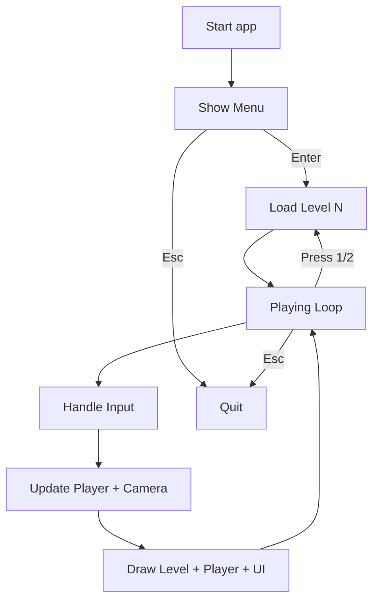

# RPG-game-

# Dungeon Platformer — Documentation

This document explains the fresh scaffold currently in D:\oops_project: how to run it, how assets are discovered, what each file does, and how to extend it.

Quick start
- Requirements: Python 3.x and pygame (pip install pygame)
- Run the game: python main.py
- Controls:
  - Menu: ENTER = start, ESC = quit
  - Game: A/D or ←/→ = move, SPACE/W/↑ = jump, ESC = quit, 1/2 = switch Level 1/2

Assets and backgrounds
- Place your Level backgrounds in D:\oops_project\assets using these names:
  - Level 1: level1.jpg (preferred) or level_1.jpg/png
  - Level 2: level2.jpg (preferred) or level_2.jpg/png
- The loader also checks:
  - assets/backgrounds/level_#.png|jpg
  - assets/Free Pixel Art Forest/PNG/Background layers/ (full.png or level_#.png)
  - Otherwise falls back to background.png/bg.png or the first image in assets
- Background behavior:
  - Images are scaled to fit screen height (keeps aspect ratio) and tiled horizontally.
  - Parallax: Level.scroll_factor = 0.2 (subtle motion). Set to 0.0 for static.

Project structure
- main.py — entry point, menu + game loop, level loading, camera, debug overlay
- settings.py — screen/FPS, color constants, physics, player size, ground height
- utils.py — draw_text helper
- level.py — Level: loads background image, draws parallax background and a flat ground with tick marks
- player.py — Player: rectangle avatar with left/right movement, jump, gravity
- assets/ — put level1.jpg, level2.jpg, or other images here (see loader rules)

Runtime flow
- Menu:
  - Low-res pixel menu is rendered to a 256x192 surface then scaled to screen for a crisp look.
  - Animated starfield background with a simple silhouette horizon.
  - ENTER switches to the game.
- Game:
  - Level(level_number) loads matching background image and draws the ground.
  - Player handles input → applies gravity → resolves ground → renders.
  - Camera follows the player on X with a lead; background parallax is 0.2.
  - Debug overlay shows FPS, state, level, player pos/vel, camera_x.

Simple flow (Mermaid)

Key configuration
- Screen and FPS: settings.py (SCREEN_WIDTH/SCREEN_HEIGHT/FPS)
- Physics: GRAVITY, MAX_FALL_SPEED; jumping: PLAYER_JUMP_POWER
- Player size: PLAYER_WIDTH/PLAYER_HEIGHT
- Ground height: GROUND_HEIGHT (flat ground strip height)
- Parallax: in level.py, Level.scroll_factor (0.0 = static, 1.0 = full speed)
