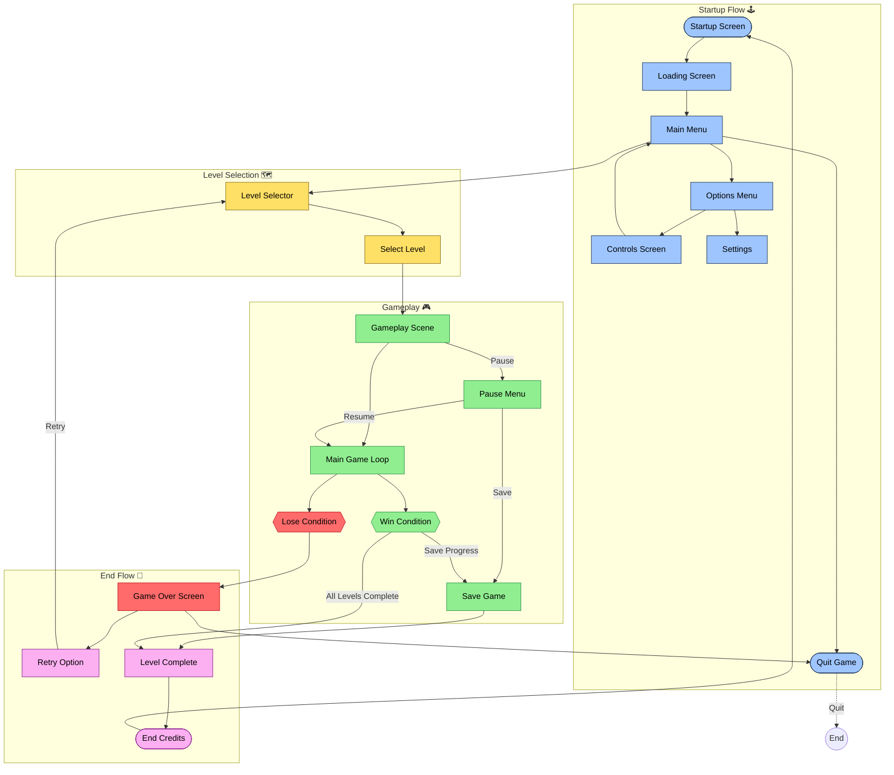

# Goblin Slayer — Documentation

## The epic dungeon platformer specifically for killing GOBLINS (Lots of them)

- tech-stack : Python 3.x and pygame
- Run the game: python main.py
- Controls:
  - start_Menu: ENTER = start, ESC = quit

    

  - Game: A/D or ←/→ = move, SPACE = jump, ESC = quit, Z = Attack, P = Pause, L = level-selector
 
    

Assets and backgrounds
-level_backgrounds — assets\backgrounds folder -- level_mid/rear images

  level_1

  

  
  level_2

  

  
  lwvel_3

 
  

  
  
-PLayer/Enemy — Photo folder — Orc/Soldier — Attack/Hit/Idle/Walk/Entity

Project structure
- main.py — entry point, menu + game loop, level loading, camera, debug overlay
- settings.py — screen/FPS, color constants, physics, player size, ground height
- utils.py — draw_text helper
- level.py — Level: loads background image, draws parallax background and a flat ground with tick marks
- player.py — Player: rectangle avatar with left/right movement, jump, gravity
- assets/ — level1.jpg, level2.jpg, or other background images here
- photo/ — player and enemy images here
- game_platform — floating platfrom logic

Runtime flow
- Menu:
  - Low-res pixel menu is rendered to a 256x192 surface then scaled to screen for a crisp look.
  - Animated starfield background with a simple silhouette horizon.
  - ENTER switches to the game.
- Game:
  - Level(level_number) loads matching background image and draws the ground, spawn enemies, loads platforms.
  - Player handles input → applies gravity → resolves ground → renders.
  - Camera follows the player on X with a lead; with background parallax.
Simple

